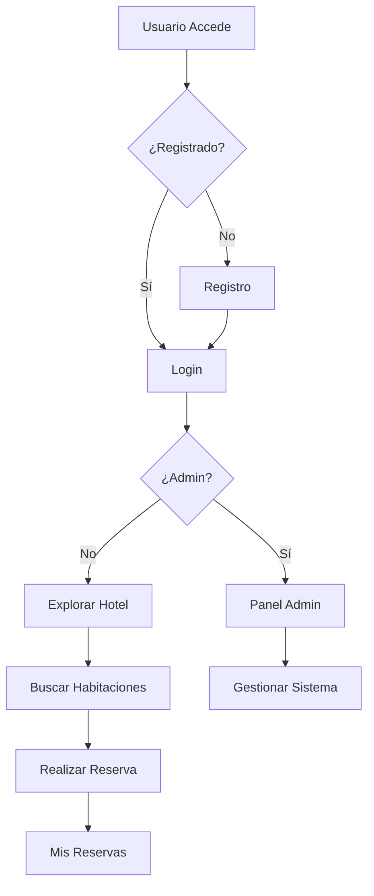

# 🏨 Hotel El Rincón del Carmen - Sistema de Reservas

<div align="center">


**Plataforma web completa para gestión de reservas hoteleras**

[🌐 Demo en Vivo](https://proyecto-javascrip.netlify.app/) | [📖 Documentación](#-tabla-de-contenidos) | [🐛 Reportar Bug](https://github.com/tu-usuario/Proyecto-js-main/issues)

</div>

---

## 📋 Tabla de Contenidos

- [Descripción General](#-descripción-general)
- [Características Principales](#-características-principales)
- [Estructura del Proyecto](#-estructura-del-proyecto)
- [Tecnologías Utilizadas](#-tecnologías-utilizadas)
- [Instalación y Configuración](#-instalación-y-configuración)
- [Credenciales de Acceso](#-credenciales-de-acceso)
- [Guía de Uso](#-guía-de-uso)
- [Panel de Administración](#-panel-de-administración)
- [Capturas de Pantalla](#-capturas-de-pantalla)
- [Contribuir](#-cómo-contribuir)
- [Licencia](#-licencia)
- [Autor](#-autor)

---

## 🎯 Descripción General

**Hotel El Rincón del Carmen** es una aplicación web moderna y completa para la gestión de reservas hoteleras. El sistema permite a los usuarios explorar habitaciones, realizar reservas y gestionar sus estadías, mientras que el administrador tiene control total sobre el sistema mediante un panel administrativo avanzado.

### ✨ Destacados del Proyecto

- 🏨 **6 Tipos de Suites Exclusivas** - Desde Junior hasta Presidencial
- 👥 **Sistema de Usuarios Multinivel** - Clientes y Administradores
- 📅 **Motor de Reservas en Tiempo Real** - Con verificación de disponibilidad
- 💾 **Persistencia de Datos** - LocalStorage para almacenamiento local
- 🎨 **Diseño Premium Responsive** - Adaptable a cualquier dispositivo
- 🔐 **Autenticación Segura** - Sistema de login y registro completo

---

## 🚀 Características Principales

### Para Usuarios

✅ **Registro y Autenticación**
- Creación de cuenta con validación de datos
- Inicio de sesión seguro
- Gestión de perfil personal

✅ **Exploración de Habitaciones**
- Catálogo completo con 6 tipos de suites
- Galería de imágenes por habitación
- Información detallada de servicios y precios

✅ **Sistema de Reservas**
- Búsqueda por fechas y capacidad
- Verificación de disponibilidad en tiempo real
- Cálculo automático de costos
- Confirmación instantánea

✅ **Gestión Personal**
- Panel "Mis Reservas"
- Visualización de reservas activas
- Historial completo de estadías
- Detalles de cada reserva

✅ **Contacto**
- Formulario de contacto funcional
- Información del hotel
- Ubicación y horarios

### Para Administradores

🔧 **Panel de Control Completo**
- Dashboard con estadísticas en tiempo real
- Gestión de todas las habitaciones (CRUD)
- Administración de usuarios
- Control total de reservas
- Filtros y búsquedas avanzadas

---

## 📁 Estructura del Proyecto

```plaintext
Hotel-Rincon-del-Carmen/
│
├── 📄 index.html                    # Página principal del hotel
├── 📄 login.html                    # Inicio de sesión
├── 📄 registro.html                 # Registro de nuevos usuarios
├── 📄 reservas.html                 # Sistema de reservas
├── 📄 mis-reservas.html             # Panel personal del usuario
├── 📄 contacto.html                 # Página de contacto
├── 📄 admin.html                    # Panel administrativo
│
├── 📁 html/                         # Páginas de habitaciones
│   ├── habitacion1.html             # Suite Deluxe
│   ├── habitacion2.html             # Suite Presidencial
│   ├── habitacion3.html             # Suite Familiar
│   ├── habitacion4.html             # Suite Junior
│   ├── habitacion5.html             # Suite Romántica
│   └── habitacion6.html             # Suite Ejecutiva
│
├── 📁 js/                           # Lógica JavaScript
│   ├── storage.js                   # Sistema de almacenamiento (localStorage)
│   ├── login.js                     # Lógica de inicio de sesión
│   ├── registro.js                  # Lógica de registro
│   ├── reservas.js                  # Motor de reservas
│   ├── mis-reservas.js              # Gestión de reservas del usuario
│   ├── admin.js                     # Funciones del panel admin
│   ├── navbar.js                    # Sistema de navegación
│   ├── navbar-user.js               # Menú de usuario
│   ├── hero-carousel.js             # Carrusel de hero
│   ├── habitaciones.js              # Lógica de habitaciones
│   └── contacto.js                  # Formulario de contacto
│
├── 📁 css/                          # Estilos modulares
│   ├── styles.css                   # Estilos globales
│   ├── auth.css                     # Estilos de autenticación
│   ├── admin.css                    # Estilos del panel admin
│   ├── reservas.css                 # Estilos de reservas
│   ├── hero-carousel.css            # Carrusel principal
│   ├── navbar-logo.css              # Estilos del navbar
│   └── contacto.css                 # Página de contacto
│
└── 📁 assets/                       # Recursos multimedia
    ├── 📁 img/
    │   ├── 📁 hero/                 # Imágenes del hero
    │   ├── 📁 rooms/                # Fotos de habitaciones
    │   └── 📁 services/             # Imágenes de servicios
    └── 📁 icons/
        └── logo1.png                # Logo del hotel
```

---

## 🛠️ Tecnologías Utilizadas

### Frontend

| Tecnología | Versión | Uso |
|------------|---------|-----|
| HTML5 | - | Estructura y contenido |
| CSS3 | - | Diseño y estilos |
| JavaScript ES6+ | - | Lógica de la aplicación |
| Bootstrap | 5.3.2 | Framework CSS responsive |
| Bootstrap Icons | 1.11.1 | Iconografía |
| AOS (Animate On Scroll) | 2.3.1 | Animaciones al scroll |

### Almacenamiento

- **LocalStorage API** - Persistencia de datos del lado del cliente
  - Usuarios y autenticación
  - Habitaciones del hotel
  - Reservas activas y canceladas
  - Sesión del usuario actual

### Despliegue

- **Netlify** - Hosting y deployment automático

---

## 💻 Instalación y Configuración

### Requisitos Previos

- Navegador web moderno (Chrome, Firefox, Safari, Edge)
- Editor de código (VS Code recomendado)
- Git (opcional, para clonar el repositorio)

### Instalación Local

```bash
# 1️⃣ Clonar el repositorio
git clone https://github.com/tu-usuario/Proyecto-js-main.git

# 2️⃣ Navegar a la carpeta del proyecto
cd Proyecto-js-main

# 3️⃣ Abrir el proyecto
# Opción A: Abrir index.html directamente en el navegador
start index.html

# Opción B: Usar Live Server en VS Code
# Click derecho en index.html → "Open with Live Server"
```

### Acceso en Línea

Puedes acceder directamente a la versión desplegada:

🔗 **[https://proyecto-javascrip.netlify.app/](https://proyecto-javascrip.netlify.app/)**

---

## 🔐 Credenciales de Acceso

### 👨‍💼 Cuenta de Administrador

Para acceder al panel administrativo completo:

```plaintext
📧 Email:     admin@rincondelcarmen.com
🔑 Contraseña: admin123
```

**Permisos del Administrador:**
- ✅ Acceso total al panel de control (`admin.html`)
- ✅ Gestión completa de habitaciones (crear, editar, eliminar)
- ✅ Visualización y administración de usuarios
- ✅ Control de todas las reservas del sistema
- ✅ Estadísticas y métricas del hotel
- ✅ Cancelación de reservas

### 👤 Usuarios Regulares

Los usuarios pueden registrarse libremente desde:
🔗 `registro.html`

**Permisos de Usuario Regular:**
- ✅ Crear cuenta personal
- ✅ Buscar y reservar habitaciones
- ✅ Ver sus propias reservas
- ✅ Consultar información del hotel
- ❌ No tiene acceso al panel administrativo

---

## 📖 Guía de Uso

### Para Usuarios Nuevos

#### 1️⃣ Registro de Cuenta

1. Ir a `registro.html` o hacer clic en "Registrarse"
2. Completar el formulario con:
   - Identificación
   - Nombre completo
   - Email (único en el sistema)
   - Teléfono
   - Nacionalidad
   - Contraseña (mínimo 6 caracteres)
3. Hacer clic en "Crear Cuenta"
4. El sistema iniciará sesión automáticamente

#### 2️⃣ Explorar Habitaciones

1. Navegar por el sitio
2. Ver el carrusel con las 6 suites disponibles
3. Hacer clic en "Ver más" para detalles completos
4. Revisar servicios, capacidad y precios

#### 3️⃣ Realizar una Reserva

1. Ir a `reservas.html`
2. Seleccionar:
   - Fecha de entrada
   - Fecha de salida
   - Número de personas
3. Hacer clic en "Buscar Habitaciones"
4. Ver resultados disponibles
5. Hacer clic en "Reservar Ahora"
6. Confirmar la reserva en el modal
7. Recibir confirmación instantánea

#### 4️⃣ Gestionar Reservas

1. Ir a "Mis Reservas" desde el menú de usuario
2. Ver todas las reservas (activas y pasadas)
3. Hacer clic en "Ver Detalles" para información completa
4. Las reservas se muestran con badges de estado

### Para Administradores

#### Acceso al Panel

1. Iniciar sesión con las credenciales de administrador
2. El sistema redirigirá automáticamente a `admin.html`
3. El menú mostrará "Administración" en lugar de "Mis Reservas"

#### Funciones Disponibles

**🏨 Gestión de Habitaciones**
- Ver todas las habitaciones en tabla
- Crear nueva habitación
- Editar información existente
- Eliminar habitaciones
- Gestionar servicios incluidos

**📅 Control de Reservas**
- Ver todas las reservas del sistema
- Filtrar por estado (confirmadas/canceladas)
- Ver detalles completos de cada reserva
- Cancelar reservas si es necesario


---

## 🎛️ Panel de Administración

### Características del Panel Admin

El archivo `admin.html` junto con `js/admin.js` implementan un sistema completo de administración:

```javascript
// Funciones principales en admin.js
- loadRooms()           // Cargar y mostrar habitaciones
- openRoomModal()       // Abrir formulario de habitación
- deleteRoomById()      // Eliminar habitación
- loadBookings()        // Cargar reservas
- filterBookings()      // Filtrar reservas por estado
- cancelBooking()       // Cancelar reserva
- viewUser()            // Ver detalles de usuario
```

### Acceso Restringido

```javascript
// Verificación automática en admin.js
if (!isAdmin()) {
  alert('Acceso denegado. Solo administradores.');
  window.location.href = 'index.html';
}
```

Solo usuarios con `role: 'admin'` pueden acceder al panel.

### Operaciones CRUD de Habitaciones

**Crear Habitación**
1. Click en "Nueva Habitación"
2. Completar formulario
3. Añadir servicios dinámicamente
4. Guardar

**Editar Habitación**
1. Click en ícono de lápiz
2. Modificar campos necesarios
3. Guardar cambios

**Eliminar Habitación**
1. Click en ícono de basura
2. Confirmar eliminación
3. Se elimina del sistema

---

## 🗄️ Sistema de Almacenamiento

### Estructura de Datos en LocalStorage

**1. Habitaciones (`hotel_rooms`)**
```javascript
{
  id: 1,
  nombre: "Suite Deluxe",
  descripcion: "Amplia suite con vista panorámica...",
  camas: 2,
  personas: 4,
  precio: 320000,
  precioNoche: 320000,
  servicios: ["WiFi", "Jacuzzi", "Minibar", "TV 55\""],
  imagen: "room2.webp",
  disponible: true
}
```

**2. Usuarios (`hotel_users`)**
```javascript
{
  id: 1,
  identificacion: "12345678",
  nombre: "Juan Pérez",
  email: "juan@email.com",
  telefono: "3001234567",
  nacionalidad: "Colombia",
  password: "******",
  role: "user", // o "admin"
  fechaRegistro: "2025-01-15T10:30:00.000Z"
}
```

**3. Reservas (`hotel_bookings`)**
```javascript
{
  id: 1704123456789,
  roomId: 1,
  userId: 2,
  fechaInicio: "2025-01-20",
  fechaFin: "2025-01-23",
  personas: 2,
  total: 960000,
  estado: "confirmada", // o "cancelada"
  fechaReserva: "2025-01-15T10:30:00.000Z"
}
```

**4. Usuario Actual (`hotel_current_user`)**
```javascript
{
  id: 2,
  nombre: "Juan Pérez",
  email: "juan@email.com",
  role: "user"
}
```

---

## 🔄 Flujo de Trabajo

### Diagrama de Flujo General



### Sistema de Verificación de Disponibilidad

```javascript
// Algoritmo de verificación en storage.js
checkAvailability(fechaInicio, fechaFin, personas) {
  1. Obtener todas las habitaciones
  2. Filtrar por capacidad >= personas
  3. Para cada habitación:
     - Buscar reservas activas
     - Verificar solapamiento de fechas
     - Si no hay conflicto → Disponible
  4. Retornar habitaciones disponibles
}
```

---

## 🧪 Pruebas y Validación

### Probar el Sistema

**1. LocalStorage**
```javascript
// Abrir DevTools (F12) → Application → Local Storage
// Ver datos almacenados:
localStorage.getItem('hotel_rooms')
localStorage.getItem('hotel_users')
localStorage.getItem('hotel_bookings')
localStorage.getItem('hotel_current_user')
```

**2. Flujo Completo**
- [ ] Registrar nuevo usuario
- [ ] Iniciar sesión
- [ ] Buscar habitaciones
- [ ] Crear reserva
- [ ] Ver en "Mis Reservas"
- [ ] Login como admin
- [ ] Ver la reserva en el panel
- [ ] Gestionar habitación

**3. Validaciones**
- ✅ Email único en registro
- ✅ Contraseña mínimo 6 caracteres
- ✅ Fechas coherentes en reservas
- ✅ Verificación de disponibilidad
- ✅ Protección de rutas admin

---

## 🤝 Cómo Contribuir

### Proceso de Contribución

1. **Fork del Proyecto**
   ```bash
   # Hacer fork desde GitHub
   # Clonar tu fork
   git clone https://github.com/TU_USUARIO/Proyecto-js-main.git
   ```

2. **Crear Rama de Funcionalidad**
   ```bash
   git checkout -b feature/nueva-funcionalidad
   ```

3. **Realizar Cambios**
   ```bash
   # Hacer commits descriptivos
   git commit -m "feat: agregar filtro de precios en reservas"
   ```

4. **Push y Pull Request**
   ```bash
   git push origin feature/nueva-funcionalidad
   # Crear Pull Request en GitHub
   ```

### Guía de Estilo

- Usar nombres descriptivos en variables y funciones
- Comentar código complejo
- Seguir la estructura modular existente
- Probar en múltiples navegadores
- Actualizar documentación si es necesario

---

## 🐛 Problemas Conocidos

### Limitaciones Actuales

1. **LocalStorage**
   - Los datos se pierden al limpiar el navegador
   - Limitado a ~5-10MB de almacenamiento
   - No hay sincronización entre dispositivos

2. **Seguridad**
   - Las contraseñas se almacenan en texto plano
   - No hay encriptación de datos sensibles
   - El rol de admin es fácilmente modificable en localStorage

3. **Funcionalidades Pendientes**
   - Sistema de pagos online
   - Notificaciones por email
   - Backend real con base de datos
   - API REST para integración

### Soluciones Futuras

- Migrar a backend con Node.js + Express
- Implementar base de datos (MongoDB/PostgreSQL)
- Agregar sistema de autenticación JWT
- Integrar pasarela de pagos
- Sistema de notificaciones

---

## 📄 Licencia

Este proyecto está bajo la **Licencia MIT**.

```
MIT License

Copyright (c) 2025 Tomás Esteban González Quintero

Se concede permiso, de forma gratuita, a cualquier persona que obtenga una copia
de este software y archivos de documentación asociados (el "Software"), para 
utilizar el Software sin restricciones, incluyendo sin limitación los derechos 
de usar, copiar, modificar, fusionar, publicar, distribuir, sublicenciar, y/o 
vender copias del Software...
```

Ver archivo [LICENSE](LICENSE) para más detalles.

---

## 👨‍💻 Autor

<div align="center">

### **Tomás Esteban González Quintero**

Desarrollador

[](https://proyecto-javascrip.netlify.app/)
[](https://github.com/tu-usuario)
[](https://linkedin.com/in/tu-perfil)
[](mailto:tu-email@gmail.com)

</div>

---

## 🌟 Agradecimientos

Este proyecto fue desarrollado como parte del aprendizaje en desarrollo web frontend.

**Recursos y Referencias:**
- [MDN Web Docs](https://developer.mozilla.org/es/) - Documentación de referencia
- [Bootstrap Documentation](https://getbootstrap.com/docs/5.3/) - Framework CSS
- [W3Schools](https://www.w3schools.com/) - Tutoriales y ejemplos
- [JavaScript.info](https://javascript.info/) - Guía completa de JS
- [Netlify](https://www.netlify.com/) - Plataforma de despliegue

**Inspiración de Diseño:**
- Sitios web de hoteles boutique
- Plataformas de reservas como Booking.com
- Sistemas de gestión hotelera modernos

---

## 📞 Soporte y Contacto

### ¿Necesitas Ayuda?

- 📧 **Email:** soporte@rincondelcarmen.com
- 🐛 **Reportar Bug:** [GitHub Issues](https://github.com/tu-usuario/Proyecto-js-main/issues)
- 💬 **Preguntas:** [GitHub Discussions](https://github.com/tu-usuario/Proyecto-js-main/discussions)

### FAQ

**¿Cómo reseteo los datos del sistema?**
```javascript
// En la consola del navegador (F12):
localStorage.clear()
location.reload()
```

**¿Cómo cambio la contraseña del admin?**
```javascript
// En storage.js, modificar el objeto del usuario admin
// O desde la consola:
let users = JSON.parse(localStorage.getItem('hotel_users'));
users[0].password = 'nueva_contraseña';
localStorage.setItem('hotel_users', JSON.stringify(users));
```

**¿Puedo agregar más habitaciones?**
Sí, usa el panel de administración → "Nueva Habitación"

---

<div align="center">

## 🌐 Enlaces Importantes

[🏠 Sitio Web](https://proyecto-javascrip.netlify.app/) | 
[📚 Documentación](https://github.com/tu-usuario/Proyecto-js-main/wiki) | 
[🐛 Reportar Bug](https://github.com/tu-usuario/Proyecto-js-main/issues) | 
[⭐ Dale una Estrella](https://github.com/tu-usuario/Proyecto-js-main)

---

**Desarrollado con ❤️ por Tomás Esteban González Quintero**

</div>